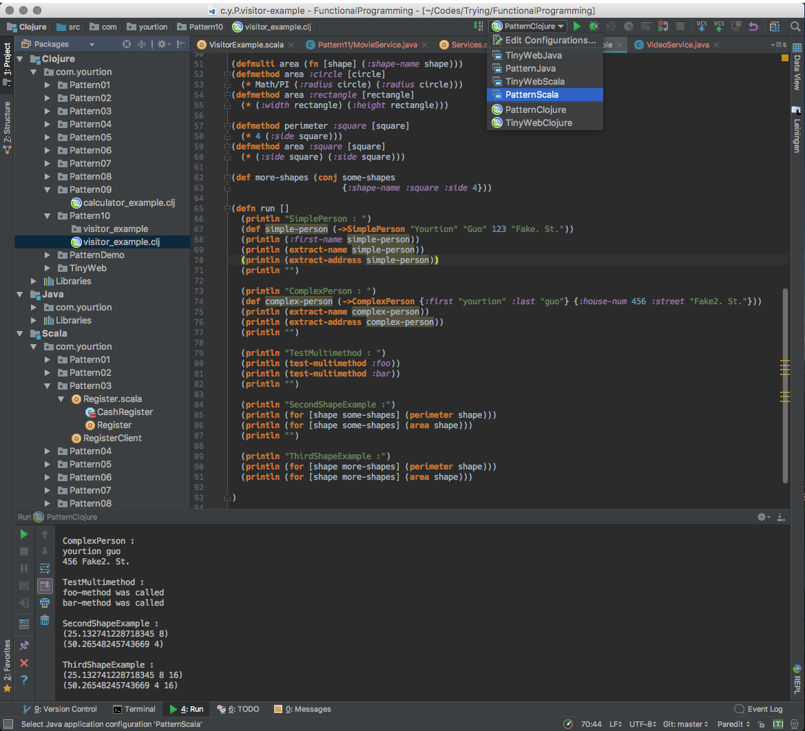

# Learning Functional Programming

《Scala与Clojure函数式编程模式：Java虚拟机高效编程》学习代码记录

- 模式1　[替代函数式接口](https://github.com/yourtion/LearningFunctionalProgramming/releases/tag/Pattern01)
- 模式2　[替代承载状态的函数式接口](https://github.com/yourtion/LearningFunctionalProgramming/releases/tag/Pattern02)
- 模式3　[替代命令模式](https://github.com/yourtion/LearningFunctionalProgramming/releases/tag/Pattern03)
- 模式4　[替代生成器模式来获得不可变对象](https://github.com/yourtion/LearningFunctionalProgramming/releases/tag/Pattern04)
- 模式5　[替代迭代器模式](https://github.com/yourtion/LearningFunctionalProgramming/releases/tag/Pattern05)
- 模式6　[替代模板方法模式](https://github.com/yourtion/LearningFunctionalProgramming/releases/tag/Pattern06)
- 模式7　[替代策略模式](https://github.com/yourtion/LearningFunctionalProgramming/releases/tag/Pattern07)
- 模式8　[替代空对象](https://github.com/yourtion/LearningFunctionalProgramming/releases/tag/Pattern08)
- 模式9　[替代装饰器模式](https://github.com/yourtion/LearningFunctionalProgramming/releases/tag/Pattern09)
- 模式10　[替代访问者模式](https://github.com/yourtion/LearningFunctionalProgramming/releases/tag/Pattern10)
- 模式11　[替代依赖注入](https://github.com/yourtion/LearningFunctionalProgramming/releases/tag/Pattern11)
- 模式12　[尾递归模式](https://github.com/yourtion/LearningFunctionalProgramming/releases/tag/Pattern12)
- 模式13　[相互递归模式](https://github.com/yourtion/LearningFunctionalProgramming/releases/tag/Pattern13)
- 模式14　[Filter-Map-Reduce模式](https://github.com/yourtion/LearningFunctionalProgramming/releases/tag/Pattern14)
- 模式15　[操作链模式](https://github.com/yourtion/LearningFunctionalProgramming/releases/tag/Pattern15)
- 模式16　[函数生成器模式](https://github.com/yourtion/LearningFunctionalProgramming/releases/tag/Pattern16)
- 模式17　[记忆模式](https://github.com/yourtion/LearningFunctionalProgramming/releases/tag/Pattern17)
- 模式18　[惰性序列模式](https://github.com/yourtion/LearningFunctionalProgramming/releases/tag/Pattern18)
- 模式19　[集中的可变性](https://github.com/yourtion/LearningFunctionalProgramming/releases/tag/Pattern19)
- 模式20　[自定义控制流](https://github.com/yourtion/LearningFunctionalProgramming/releases/tag/Pattern20)
- 模式21　[领域特定语言](https://github.com/yourtion/LearningFunctionalProgramming/releases/tag/Pattern21)

## 运行与编译

基于 IntelliJ 环境，切换到对应的 [`tag`](https://github.com/yourtion/LearningFunctionalProgramming/releases/) 即可运行相关模式代码，不同代码通过上方运行环境切换。

